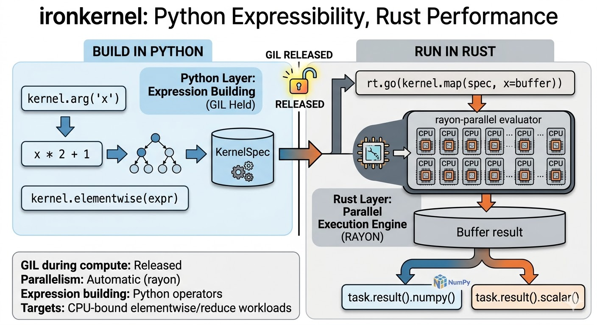

# ironkernel

### Python Expressibility, Rust Performance

[](https://github.com/YuminosukeSato/ironkernel/actions/workflows/ci.yml)
[](https://pypi.org/project/ironkernel/)
[](https://pypi.org/project/ironkernel/)
[](https://github.com/YuminosukeSato/ironkernel/blob/main/LICENSE)

Write NumPy-like expressions in Python. Execute them in parallel on Rust, outside the GIL.

Rayon uses all CPU cores automatically. Go-style channels and select enable concurrent pipelines.



```text
Python DSL                        Rust engine
------------------------------    ---------------------------------
kernel.arg / @kernel.elementwise  build IR / KernelSpec / MapSpec
rt.go(...)                        release GIL and execute in rayon
task.result()                     return Buffer / scalar result
chan / select                     bounded channel handoff
```

---

## Install

### pip install (Recommended)

Install into the Python environment you will run the code with using `python -m pip`.
Python 3.9+ and NumPy 1.24+ are required.

```bash
python -m pip install --upgrade pip
python -m pip install ironkernel
```

Verify the installation:

```bash
python -m pip show ironkernel
python -c "import ironkernel; print('ironkernel', ironkernel.__version__)"
```

The `ironkernel._ironkernel` extension installs as a prebuilt wheel whenever a compatible
OS/Python combination exists. On systems without a matching wheel, pip falls back to source
build, which requires a working Rust toolchain (typically for development environments).

Common issues:

- `No module named 'numpy'`
  - Run: `python -m pip install numpy`
- `ModuleNotFoundError: No module named 'ironkernel._ironkernel'`
  - Usually caused by installing into a different interpreter. Use `python -m pip` from the same
    interpreter you run your script with.
- Reinstalling a previous package version
  - `python -m pip uninstall -y ironkernel && python -m pip install --force-reinstall ironkernel`

### Local development from source

```bash
git clone https://github.com/YuminosukeSato/ironkernel.git
cd ironkernel
uv sync --frozen --dev
uv run maturin develop
```

Source builds require `uv` and a Rust toolchain. For normal usage, the PyPI `pip install` path
is usually enough.

### Minimal usage with Python

```python
import numpy as np
from ironkernel import kernel, rt

# 1) Prepare input buffers
a = rt.asarray(np.array([1.0, 2.0, 3.0], dtype=np.float64))
b = rt.asarray(np.array([10.0, 20.0, 30.0], dtype=np.float64))

# 2) Define computation with the DSL
@kernel.elementwise
def add(x, y):
    return x + y

# 3) Convert to execution spec
spec = kernel.map(add, x=a, y=b)

# 4) Execute (GIL is released inside Rust runtime)
task = rt.go(spec)
out = task.result()        # Blocks until task completion
arr = out.numpy()
print(arr)                 # [11. 22. 33.]

# Get scalar result when buffer has one element
print(task.result().scalar())  # Example: single-element buffer
```

### Asynchronous pipeline with channels

```python
import numpy as np
from ironkernel import chan, kernel, rt

@kernel.elementwise
def double(x):
    return x * 2.0

src = rt.asarray(np.arange(6, dtype=np.float64))
out_ch = chan(4)
task = rt.go(kernel.map(double, x=src), out=out_ch)

# Receive from channel in consumer code (blocking)
buf = out_ch.recv()
print(buf.numpy()[:3])     # [0., 2., 4.]

# If you need explicit task completion state, call task.result()
task.result()
```

---

## Examples

### 1. SAXPY — Decorator Syntax

Write a plain function. The decorator turns it into a parallel kernel.

```python
import numpy as np
from ironkernel import kernel, rt

@kernel.elementwise
def saxpy(a, x, y):
    return a * x + y

bx = rt.asarray(np.arange(1_000_000, dtype=np.float64))
by = rt.asarray(np.ones(1_000_000, dtype=np.float64))

result = rt.go(kernel.map(saxpy, a=2.0, x=bx, y=by)).result().numpy()
# result[0]=1.0, result[1]=3.0, result[2]=5.0, ...
```

### 2. Math Functions

```python
import numpy as np
from ironkernel import kernel, rt

@kernel.elementwise
def transform(x):
    return kernel.sqrt(kernel.abs(x)) + kernel.sin(x)

buf = rt.asarray(np.arange(1_000_000, dtype=np.float64))
out = rt.go(kernel.map(transform, x=buf)).result().numpy()
```

### 3. Manual Expression Tree

Build expression trees with Python operators instead of the decorator.

```python
import numpy as np
from ironkernel import kernel, rt

x, y = kernel.args("x", "y")
spec = kernel.elementwise(x + y)

left = rt.asarray(np.array([1.0, 2.0, 3.0]))
right = rt.asarray(np.array([10.0, 20.0, 30.0]))

result = rt.go(kernel.map(spec, x=left, y=right)).result().numpy()
print(result)  # [11. 22. 33.]
```

### 4. Reductions

```python
import numpy as np
from ironkernel import kernel, rt

buf = rt.asarray(np.arange(100, dtype=np.float64))

total = rt.go(kernel.sum(buf)).result().scalar()       # 4950.0
avg   = rt.go(kernel.mean(buf)).result().scalar()       # 49.5
lo    = rt.go(kernel.min_reduce(buf)).result().scalar()  # 0.0
hi    = rt.go(kernel.max_reduce(buf)).result().scalar()  # 99.0
```

### 5. ReLU — Lazy Conditional

`kernel.where` only evaluates the selected branch per element.

```python
import numpy as np
from ironkernel import kernel, rt

@kernel.elementwise
def relu(x):
    return kernel.where(x > 0, x, 0)

buf = rt.asarray(np.arange(100, dtype=np.float64) - 50)
out = rt.go(kernel.map(relu, x=buf)).result().numpy()
# negative values → 0, positive values → unchanged
```

### 6. Channels and Select

Go-style bounded channels for concurrent task communication.

```python
import numpy as np
from ironkernel import RecvCase, chan, kernel, rt, select

ch_a = chan(10)
ch_b = chan(10)

ch_a.send(rt.asarray(np.array([42.0])))

idx, val = select(RecvCase(ch_a), RecvCase(ch_b), default=True)
# idx=0, val.scalar()=42.0
```

### 7. Channel Handoff (`out=channel`)

Send computation results directly to a channel. Build producer-consumer pipelines.

```python
import numpy as np
from ironkernel import chan, kernel, rt

@kernel.elementwise
def double(x):
    return x * 2.0

buf = rt.asarray(np.arange(1_000_000, dtype=np.float64))

c = chan(10)
task = rt.go(kernel.map(double, x=buf), out=c)
result = c.recv()   # blocks until delivery completes
task.result()       # wait for terminal completion if you need it
print(result.numpy()[:5])  # [0. 2. 4. 6. 8.]
```

`Channel.recv()` returning means the buffer was delivered. It does not guarantee that `TaskHandle.is_done()` has already become visible in the same instant. If you need terminal completion, call `task.result()`.

## Quality Gates

```bash
make verify-all
make coverage-python
make coverage-rust
make stress
make mutate-core
```

- `coverage-python` enforces 100% statement and branch coverage for `python/ironkernel/`.
- `coverage-rust` instruments both Rust tests and Python execution paths, then fails on any uncovered `src/` line except PyO3 `#[pymethods]` annotation lines that LLVM reports as uncovered.
- `stress` repeats the concurrency-sensitive Rust and Python suites to catch flakes.
- `mutate-core` runs `cargo-mutants` against fast `mutation_guard` tests for the runtime, channel, and Python boundary slice, then fails on any surviving mutant or timeout.

---

## API Reference

### Expression Building

| API | Description |
|-----|-------------|
| `kernel.arg("x")` | Create a named placeholder |
| `kernel.args("x", "y", ...)` | Create multiple placeholders |
| `kernel.elementwise(expr_or_fn)` | Build `KernelSpec` from expression or function |
| `kernel.where(cond, true_val, false_val)` | Conditional (lazy: only selected branch evaluated) |

Arithmetic: `+`, `-`, `*`, `/`, `**` (reverse ops like `2.0 * x` supported)
Comparison: `>`, `>=`, `<`, `<=`, `==`, `!=`
Math: `sqrt`, `abs`, `log`, `exp`, `log2`, `log10`, `sin`, `cos`, `tan`, `floor`, `ceil`, `pow`, `atan2`, `min`, `max`

### Execution

| API | Description |
|-----|-------------|
| `rt.asarray(np_array)` | Create `Buffer` from NumPy array |
| `kernel.map(spec, **kwargs)` | Bind arguments to create `MapSpec` |
| `rt.go(spec)` | Launch computation, return `TaskHandle` |
| `rt.go(spec, out=channel)` | Launch and deliver result to channel |

### Results

| API | Description |
|-----|-------------|
| `task.result()` | Block until done, return `Buffer` |
| `buffer.numpy()` | Convert to NumPy ndarray |
| `buffer.scalar()` | Extract scalar f64 |
| `task.is_done()` | Check completion |
| `task.cancel()` | Cancel task |

### Reductions

| API | Description |
|-----|-------------|
| `kernel.sum(buf)` | Sum all elements |
| `kernel.mean(buf)` | Arithmetic mean |
| `kernel.min_reduce(buf)` | Minimum value |
| `kernel.max_reduce(buf)` | Maximum value |

### Channels

| API | Description |
|-----|-------------|
| `chan(capacity)` | Create bounded channel |
| `channel.send(buf)` | Send buffer (blocks if full) |
| `channel.recv()` | Receive buffer (blocks if empty) |
| `channel.close()` | Close channel |
| `select(RecvCase(ch), ..., default=True)` | Non-blocking receive from multiple channels |

### Decorator Constraints

`@kernel.elementwise` supported constructs:

- Arithmetic, comparison, power
- Unary minus `-x`
- `abs()`, `math.sqrt()`, `math.sin()`, etc.
- `kernel.where()`, `kernel.sqrt()`, etc.
- Constants (`int`, `float`)

Unsupported (raises `SyntaxError`):

- if/else, for/while, assignments
- `*args` / `**kwargs` / default arguments
- `and` / `or` / `not`
- Closure variables

---

## Architecture

```text
python/ironkernel/    Public Python API, facades, type stubs
src/python/           PyO3 boundary (only place that imports pyo3)
src/ir/               Expression tree, compiler, evaluator, compile cache
src/buffer/           Buffer storage with Arc-based sharing
src/runtime/          Task lifecycle, delivery executor
src/channel/          Bounded channels, select multiplexing
```

---

## Development

```bash
# Build
uv run maturin develop            # debug
uv run maturin develop --release  # optimized

# Test
cargo test && uv run maturin develop && uv run pytest tests/python/ -v

# Lint
cargo clippy --all-targets -- -D warnings && cargo fmt --check
uv run ruff check python/ tests/ && uv run mypy python/ironkernel/ --strict
```

## License

MIT
